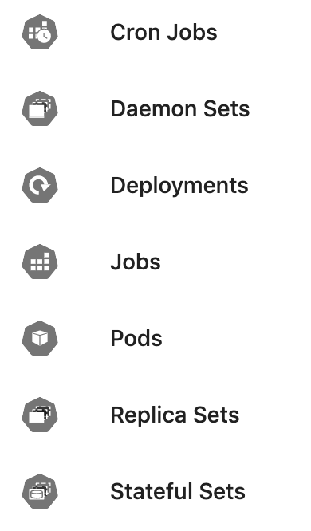

# Kubernetes icons for the web

The community has created some [awesome icons](https://github.com/kubernetes/community/tree/master/icons) for many of the components and resources in Kubernetes. These require a little extra massage to work natively on the web as icons.



## Usage

1. Host `k8s.svg` somewhere.
1. Where you'd like to use an icon, add this markup:

```html
<svg class="icon">
    <use xlink:href="/path-to/k8s.svg#resources-unlabeled-ns"></use>
</svg>
```

### Notes

- The naming scheme follows the directory structure. If you want the deployment icon that has been labeled, you would use `resources-labeled-deploy`.
- To configure the colors, you can use `--background` and `--foreground` in your CSS.
- You'll want to style the SVG as by default they'll grow to fill the container.

## Building

```bash
make build
```

This will:

- Checkout the latest version of the icons.
- Build a container that can run the script.
- Update `k8s.svg`.
